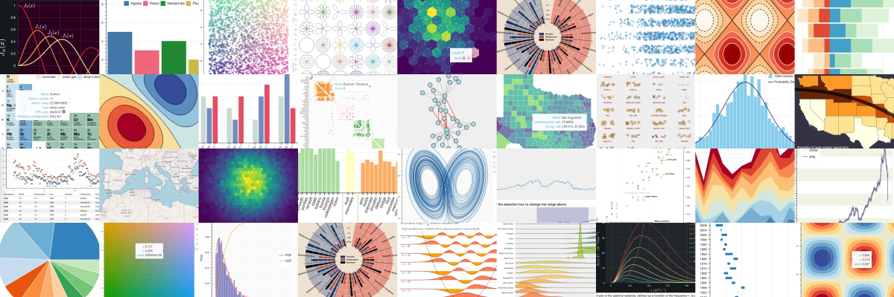

:notoc:
:html_theme.sidebar_secondary.remove:

.. _about:

Bokeh documentation
===================

Bokeh is a Python library for creating interactive visualizations for modern
web browsers. It helps you build beautiful graphics, ranging from simple plots
to complex dashboards with streaming datasets. With Bokeh, you can create
JavaScript-powered visualizations without writing any JavaScript yourself.

.. raw:: html

    

        <form class="bd-search align-items-center" action="search.html" method="get">
          <input type="search" class="form-control search-front-page" name="q" id="search-input" placeholder="&#128269; Search the docs ..." aria-label="Search the docs ..." autocomplete="off">
        </form>
    

Finding the right documentation resources
-----------------------------------------

Bokeh's documentation consists of several components:

.. grid:: 1 1 3 3

    .. grid-item-card::

        If you are new to Bokeh
        ^^^
        Follow these guides to get started:

        * :ref:`first_steps`: simple tutorials that walk you through installing Bokeh and creating your first visualizations.

        * :ref:`userguide`: explanations of all key functionalities of Bokeh and how to use them. Includes several standalone examples.

    .. grid-item-card::

        If you have some basic knowledge of Bokeh
        ^^^
        Learn more by exploring examples:

        * :ref:`gallery`: a collection of examples with source code.

        * `Interactive tutorial notebooks`_: a collection of interactive notebooks to experiment with all elements of Bokeh.

        * :ref:`userguide`: explanations of all key functionalities of Bokeh and how to use them, including examples.

    .. grid-item-card::

        If you need more advanced information
        ^^^
        Get to know every aspect of Bokeh:

        * :ref:`Reference guide <refguide>`: detailed information about all of Bokeh's components.

        * :ref:`Contributor guide <contributor_guide>`: information on the various ways you can contribute to the Bokeh project.

Connecting with the Bokeh community
-----------------------------------

There are various ways to get in touch with the `Bokeh community`_:

* The `Bokeh Discourse`_ is the best place to ask usage questions and is a
  great way to get feedback from other users on how to approach a problem.
* Questions involving pandas or other libraries may find a wider audience by
  posting with the `"bokeh" tag on Stack Overflow`_.
* If you think you've found a bug, or would like to request a feature, please
  report an issue at `Bokeh's GitHub repository`_.

You can also find more information about Bokeh on `Medium`_, and `LinkedIn`_.

.. toctree::
    :maxdepth: 3
    :hidden:

    docs/first_steps
    docs/user_guide
    docs/gallery
    docs/reference
    docs/dev_guide
    docs/releases

.. _Interactive tutorial notebooks: https://mybinder.org/v2/gh/bokeh/bokeh-notebooks/HEAD?labpath=index.ipynb
.. _Bokeh community: https://bokeh.org/community/
.. _Bokeh Discourse: https://discourse.bokeh.org
.. _`"bokeh" tag on Stack Overflow`: https://stackoverflow.com/questions/tagged/bokeh
.. _`Bokeh's GitHub repository`: https://github.com/bokeh/bokeh
.. _Medium: https://medium.com/bokeh
.. _LinkedIn: https://www.linkedin.com/company/project-bokeh/
.. _gallery: docs/gallery.html
