BokehJS Interface Reference
===========================

.. contents::
    :local:
    :depth: 2

.. _bokehjs_data_source:

Data Sources
************
Data is typically passed to bokehjs through a ``ColumnDataSource`` which has named columns
of data that are available to glyph renderers. Note that all the columns in a given
``ColumnDataSource`` should have the same length. It is possible and often necessary to have
different data sources for different renderers.

.. warning:: JavaScript ``null`` values are not valid inputs to BokehJS renderers. Please be aware that they will be silently interpreted as zero.

.. _bokehjs_line_properties:

Line Properties
***************
BokehJS exposes all the standard HTML5 canvas path stroking properties. All of these
properties may take single values, or references to vectors of data. For instance, it
is possible to draw multiple rectangles at once using the ``rect`` glyph. They may
all be given the same ``line_width`` or each rectangle may be given its own ``line_width``.

.. include:: ../includes/line_props.txt

.. _bokehjs_fill_properties:

Fill Properties
***************
BokehJS exposes all the standard HTML5 path filling properties. All of these properties
may take single values, or references to vectors of data. For instance, it is possible to
draw multiple rectangles at once using the ``rect`` glyph. They may all be given the same
``fill_width``, or each rectangle may be given its own ``fill_width``.

.. include:: ../includes/fill_props.txt

.. _bokehjs_text_properties:

Text Properties
***************
BokehJS exposes most of the standard HTML5 text properties. All of these properties
may take single values, or references to vectors of data. For instance, it is possible to
draw multiple text items at once using the ``text`` glyph. They may all be given the same
``font_size`` or each line of text may be given its own ``font_size``.

.. include:: ../includes/text_props.txt

.. _bokehjs_markers:

Markers
*******
Markers are a subset of BokehJS glyphs that have a uniform interface and are suitable for simple
scatter type plots. All markers expose the following fields:

* ``x``, ``y`` - center point coordinates
* ``size`` - screen units

and have :ref:`bokehjs_line_properties` and :ref:`bokehjs_fill_properties` as appropriate.

.. _bokehjs_glyphs:

Glyphs
******

Bokeh plots are centered around glyphs, which generally have some combination of line, fill, or
text properties, depending on what is appropriate for a given glyph. For example, the ``Circle``
glyph has both line and fill properties, but the ``Bezier`` glyph only has line properties.

.. note:: Each of the glyph images below links to a live JSFiddle.

.. _bokehjs_annular_wedge:

``annular_wedge``
-----------------
The annular_wedge glyph displays annular wedges centered at the given coordinates with the
corresponding ``start_radius``, ``end_radius``,  ``start_angle`` and ``end_angle``.

.. note:: the ``direction`` field may be used to indicate which direction the drawing should occur between ``start_radius`` and ``end_radius``.

* ``x``, ``y`` - center point coordinates
* ``start_radius``
* ``end_radius``
* ``start_angle``
* ``end_angle``
* ``direction``

  * values: ``'clock'``, ``'anticlock'``
  * default: ``'anticlock'``

* :ref:`bokehjs_line_properties`
* :ref:`bokehjs_fill_properties`

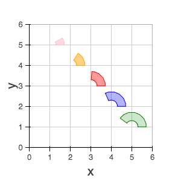

.. _bokehjs_annulus:

``annulus``
-----------
The annulus glyph displays annular rings centered at the given coordinates with the
corresponding ``start_radius`` and ``end_radius``.

* ``x``, ``y`` - center point coordinates
* ``start_radius``
* ``end_radius``
* :ref:`bokehjs_line_properties`
* :ref:`bokehjs_fill_properties`

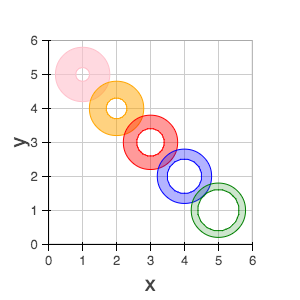

.. _bokehjs_arc:

``arc``
-------
The annulus glyph displays circular line arcs centered at the given coordinates with the
corresponding ``radius``, ``start_angle`` and ``end_angle``.

.. note:: the ``direction`` field may be used to indicate which direction the drawing should occur between ``start_radius`` and ``end_radius``.

* ``x``, ``y`` - center point coordinates
* ``radius``
* ``start_angle``
* ``end_angle``
* ``direction``

  * values: [``'clock'`` or ``'anticlock'``]
  * default: ``'anticlock'``

* :ref:`bokehjs_line_properties`

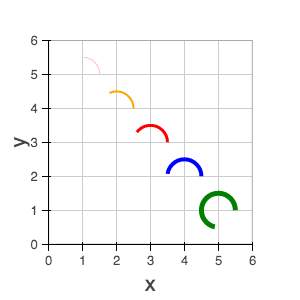

.. _bokehjs_asterisk:

``asterisk``
------------
The asterisk glyph is a :ref:`marker <bokehjs_markers>` that displays asterisks at
the given coordinates.

* ``x``, ``y`` - center point coordinates
* ``size``
* :ref:`bokehjs_line_properties`

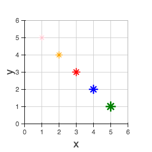

.. _bokehjs_bezier:

``bezier``
----------
The bezier glyph displays Bezier curves with the given starting, ending, and control points.

* ``x0``, ``y0`` - starting point coordinates
* ``x1``, ``y1`` - ending point coordinates
* ``cx0``, ``cy0`` - first control point coordinates
* ``cx1``, ``cy1`` - second control point coordinates
* :ref:`bokehjs_line_properties`

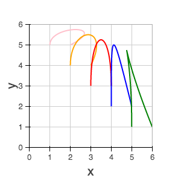

.. _bokehjs_circle:

``circle``
----------
The circle glyph has two forms, a :ref:`marker <bokehjs_markers>` form that takes a ``size``
field or a non-marker form that takes a ``radius`` field.

+------------------------------------------+------------------------------------------+
|* ``x``, ``y`` - center point coordinates |* ``x``, ``y`` - center point coordinates |
|* ``size``                                |* ``radius``                              |
|* :ref:`bokehjs_line_properties`          |* :ref:`bokehjs_line_properties`          |
|* :ref:`bokehjs_fill_properties`          |* :ref:`bokehjs_fill_properties`          |
+------------------------------------------+------------------------------------------+

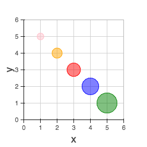

.. _bokehjs_circle_cross:

``circle_cross``
----------------
The circle_cross glyph is a :ref:`marker <bokehjs_markers>` that displays circles
together with a crossbar (+) at the given coordinates.

* ``x``, ``y`` - center point coordinates
* ``size``
* :ref:`bokehjs_line_properties`
* :ref:`bokehjs_fill_properties`

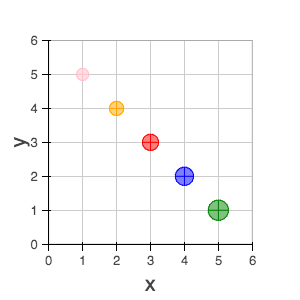

.. _bokehjs_circle_x:

``circle_x``
------------
The circle_x glyph is a :ref:`marker <bokehjs_markers>` that displays circles
together with an X at the given coordinates.

* ``x``, ``y`` - center point coordinates
* ``size``
* :ref:`bokehjs_line_properties`
* :ref:`bokehjs_fill_properties`

.. image:: ../../_images/bokehjs_glyphs/circle_x.png
    :height: 300px
    :alt: Click to view JSFiddle
    :target: http://jsfiddle.net/bokeh/YxLQm/

.. _bokehjs_cross:

``cross``
---------
The cross glyph is a :ref:`marker <bokehjs_markers>` that displays crossbar symbols (+)
at the given coordinates.

* ``x``, ``y`` - center point coordinates
* ``size``
* :ref:`bokehjs_line_properties`

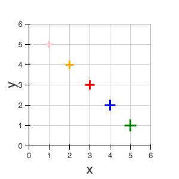

.. _bokehjs_diamond:

``diamond``
-----------
The diamond glyph is a :ref:`marker <bokehjs_markers>` that displays diamonds
at the given coordinates.

* ``x``, ``y`` - center point coordinates
* ``size``
* :ref:`bokehjs_line_properties`
* :ref:`bokehjs_fill_properties`

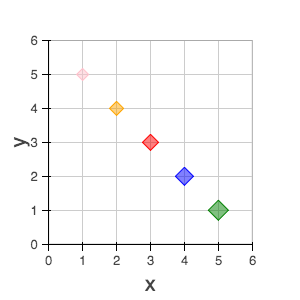

.. _bokehjs_diamond_cross:

``diamond_cross``
-----------------
The diamond_cross glyph is a :ref:`marker <bokehjs_markers>` that displays diamonds
together with a crossbar (+) at the given coordinates.

* ``x``, ``y`` - center point coordinates
* ``size``
* :ref:`bokehjs_line_properties`
* :ref:`bokehjs_fill_properties`

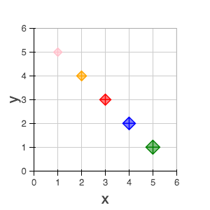

.. _bokehjs_image:

``image``
---------
The image glyph has two forms. The first form takes each ``image`` as a one-dimensional
array of scalar values together with ``rows`` and ``cols`` fields that describe the two-dimensional
shape of the array. The second form takes each ``image`` as a"array of arrays" (assumed to be
non-ragged) and the shape is inferred automatically. A ``palette`` (string name of a built-in
palette, currently) must also be supplied to use for color-mapping the scalar image.

.. note:: The image glyph is vectorized like other glyphs, i.e. it may be used to display several images at once.

.. warning:: The second (2D) form is significantly less efficient. It is currently used by the python interface to send data to the browser, but may be deprecated in the future.

+-----------------------------------------+-----------------------------------------+
| * ``image`` - 1D array of data          | * ``image`` - 2D array of data          |
| * ``rows`` - number of rows in image    | * ``x``, ``y`` - lower left             |
| * ``cols`` - number of columns in image | * ``dw`` - width on screen              |
| * ``x``, ``y`` - lower left             | * ``dh``- height on screen              |
| * ``dw`` - width on screen              | * ``palette``                           |
| * ``dh``- height on screen              |                                         |
| * ``palette``                           |                                         |
+-----------------------------------------+-----------------------------------------+

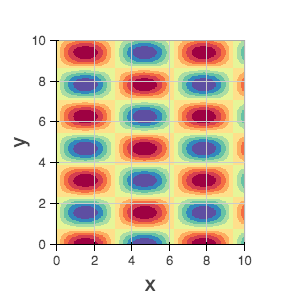

.. _bokehjs_image_rgba:

``image_rgba``
--------------
The image_rgba glyph has two forms. The first form takes each ``image`` as a one-dimensional
array of RGBA values (encoded as 32-bit integers) together with ``rows`` and ``cols`` fields
that describe the two-dimensional shape of the array. The second form takes each ``image`` as a
"array of arrays" (assumed to be non-ragged) and the shape is inferred automatically.

.. note:: The image_rgba glyph is vectorized like other glyphs, i.e. it may be used to display several images at once.

.. warning:: The second (2D) form is significantly less efficient. It is currently used by the python interface to send data to the browser, but may be deprecated in the future.

+-----------------------------------------+-----------------------------------------+
| * ``image`` - 1D array of RGBA          | * ``image`` - 2D array of RGBA          |
| * ``rows`` - number of rows in image    | * ``x``, ``y`` - lower left             |
| * ``cols`` - number of columns in image | * ``dw`` - width on screen              |
| * ``x``, ``y`` - lower left             | * ``dh``- height on screen              |
| * ``dw`` - width on screen              |                                         |
| * ``dh``- height on screen              |                                         |
+-----------------------------------------+-----------------------------------------+

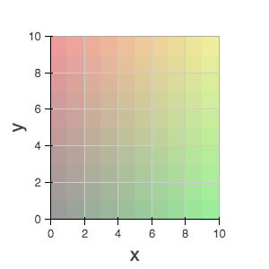

.. _bokehjs_image_url:

``image_url``
-------------
The image_url glyph accepts the URLs of an images to display. The images are centered
on the given coordinates and rotated by the given angles.

* ``x``, ``y`` - center point coordinates
* ``url``
* ``angle``

.. _bokehjs_inverted_triangle:

``inverted_triangle``
---------------------
The inverted_triangle glyph is a :ref:`marker <bokehjs_markers>` that displays
upside-down triangles at the given coordinates.

* ``x``, ``y`` - center point coordinates
* ``size``
* :ref:`bokehjs_line_properties`
* :ref:`bokehjs_fill_properties`

.. _bokehjs_line:

``line``
--------
The line glyphs displays a single line that connects several points given by the arrays
of coordinates ``x`` and ``y``.

* ``x``, ``y`` - line coordinates
* :ref:`bokehjs_line_properties`

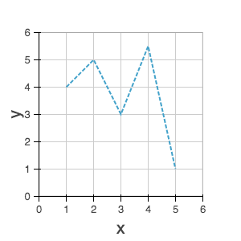

.. _bokehjs_multi_line:

``multi_line``
--------------
The multi_line glyphs displays several lines, each with points given by the arrays of
coordinates that are the elements of ``xs`` and ``ys``. This glyph is especially useful for
implementing parallel coordinates plots, or plotting several aligned series simultaneously.

.. note:: For this glyph, the vector data is not simply an array of scalars, it is really an "array of arrays".

* ``xs``, ``ys`` - lists of line coordinates
* :ref:`bokehjs_line_properties`

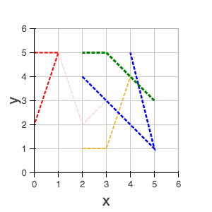

.. _bokehjs_oval:

``oval``
--------
The oval glyph displays ovals centered on the given coordinates with the given dimensions
and angle.

* ``x``, ``y`` - center point coordinates
* ``width``
* ``height``
* ``angle``

  * default: 0

* :ref:`bokehjs_line_properties`
* :ref:`bokehjs_fill_properties`

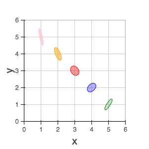

.. _bokehjs_patch:

``patch``
---------
The line glyphs displays a single polygonal patch that connects several points given by the arrays
of coordinates ``x`` and ``y``.

* ``x``, ``y`` - coordinates
* :ref:`bokehjs_line_properties`
* :ref:`bokehjs_fill_properties`

.. image:: ../../_images/bokehjs_glyphs/patch.png
    :height: 300px
    :alt: Click to view JSFiddle
    :target: http://jsfiddle.net/bokeh/SuzwP/

.. _bokehjs_patches:

``patches``
-----------
The patches glyphs displays several patches, each with points given by the arrays of
coordinates that are the elements of ``xs`` and ``ys``. This glyph is especially useful for
implementing stacked area charts and cartograms.

.. note:: For this glyph, the vector data is not simply an array of scalars, it is really an "array of arrays".

* ``xs``, ``ys`` - lists of coordinates
* :ref:`bokehjs_line_properties`
* :ref:`bokehjs_fill_properties`

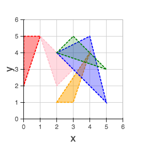

.. _bokehjs_quad:

``quad``
--------
The quad glyph displays axis-aligned rectangles with the given dimensions.

* ``left``
* ``right``
* ``top``
* ``bottom``
* :ref:`bokehjs_line_properties`
* :ref:`bokehjs_fill_properties`

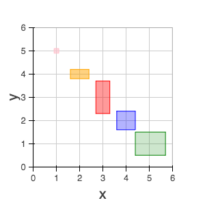

.. _bokehjs_quadratic:

``quadratic``
-------------
The quadratic glyph displays quadratic curves with the given starting, ending, and control points.

* ``x0``, ``y0`` - starting point coordinates
* ``x1``, ``y1`` - ending point coordinates
* ``cx``, ``cy`` - control point coordinates
* :ref:`bokehjs_line_properties`

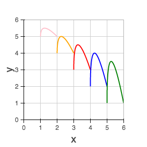

.. _bokehjs_ray:

``ray``
-------
The ray glyph displays line segments starting at the given coordinate and extending the given
``length`` at the given ``angle``.

* ``x0``, ``y0`` - starting point coordinates
* ``length`` - screen units
* ``angle``

  * default: 0

* :ref:`bokehjs_line_properties`

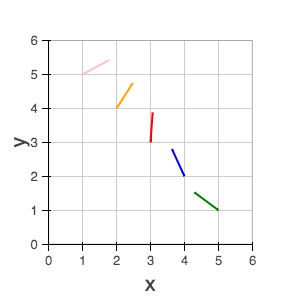

.. _bokehjs_rect:

``rect``
--------
The rect glyph displays rectangles centered on the given coordinates with the given dimensions
and angle.

* ``x``, ``y`` - center point coordinates
* ``width``
* ``height``
* ``angle``

  * default: 0

* :ref:`bokehjs_line_properties`
* :ref:`bokehjs_fill_properties`

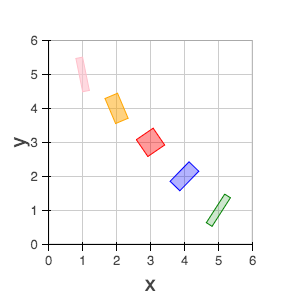

.. _bokehjs_segment:

``segment``
-----------
The segment glyph displays line segments with the given starting and ending coordinates.

* ``x0``, ``y0`` - starting point coordinates
* ``x1``, ``y1`` - ending point coordinates
* :ref:`bokehjs_line_properties`

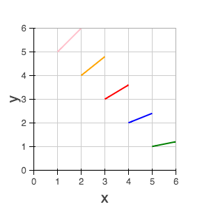

.. _bokehjs_square:

``square``
----------
The square glyph is a :ref:`marker <bokehjs_markers>` that displays squares
at the given coordinates.

* ``x``, ``y`` - center point coordinates
* ``size``
* :ref:`bokehjs_line_properties`
* :ref:`bokehjs_fill_properties`

.. _bokehjs_square_cross:

``square_cross``
----------------
The square_cross glyph is a :ref:`marker <bokehjs_markers>` that displays squares
together with a crossbar (+) at the given coordinates.

* ``x``, ``y`` - center point coordinates
* ``size``
* :ref:`bokehjs_line_properties`
* :ref:`bokehjs_fill_properties`

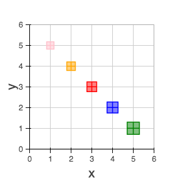

.. _bokehjs_square_x:

``square_x``
------------
The square_x glyph is a :ref:`marker <bokehjs_markers>` that displays squares
together with an X at the given coordinates.

* ``x``, ``y`` - center point coordinates
* ``size``
* :ref:`bokehjs_line_properties`
* :ref:`bokehjs_fill_properties`

.. _bokehjs_text:

``text``
--------
The text glyph displays text at the given coordinates rotated by the given angle. The
location of the coordinates relative to the text is indicated by the text properties.

* ``x``, ``y`` - text coordinates (positioning determined by text properties)
* ``text``
* ``angle``

  * default: 0

* :ref:`bokehjs_text_properties`

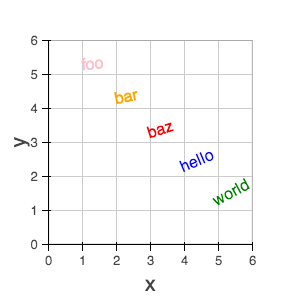

.. _bokehjs_triangle:

``triangle``
------------
The triangle glyph is a :ref:`marker <bokehjs_markers>` that displays triangles
at the given coordinates.

* ``x``, ``y`` - center point coordinates
* ``size``
* :ref:`bokehjs_line_properties`
* :ref:`bokehjs_fill_properties`

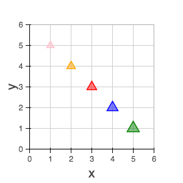

.. _bokehjs_wedge:

``wedge``
---------
The annular_wedge glyph displays circular wedges centered at the given coordinates with the
corresponding ``radius``,  ``start_angle`` and ``end_angle``.

.. note:: the ``direction`` field may be used to indicate which direction the drawing should occur between ``start_radius`` and ``end_radius``.

* ``x``, ``y`` - center point coordinates
* ``radius``
* ``start_angle``
* ``end_angle``
* ``direction``

  * values: [``'clock'`` or ``'anticlock'``]
  * default: ``'anticlock'``

* :ref:`bokehjs_line_properties`
* :ref:`bokehjs_fill_properties`

.. image:: ../../_images/bokehjs_glyphs/wedge.png
    :height: 300px
    :alt: Click to view JSFiddle
    :target: http://jsfiddle.net/bokeh/4H7R6/

.. _bokehjs_x:

``x``
-----
The x glyph is a :ref:`marker <bokehjs_markers>` that displays X symbols at
the given coordinates.

* ``x``, ``y`` - center point coordinates
* ``size``
* :ref:`bokehjs_line_properties`
* :ref:`bokehjs_fill_properties`

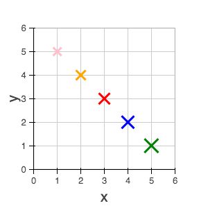

